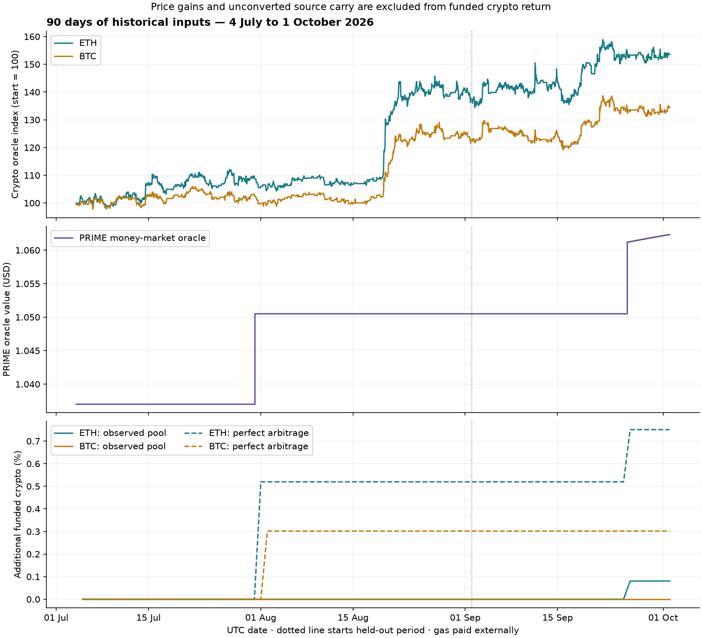

# Propeller: four rounds of historical modeling

The observed July–October market inputs do **not** establish a better launch
setting. The $10,000 baseline accumulates **0.0804% additional ETH and 0% BTC from PRIME carry**
over this 90-day window. Perfect arbitrage raises those figures to **0.7509%
and 0.3017%**, with fees still charged. The main constraints are when PRIME
value becomes visible to the money-market oracle and when acceptable entry
quotes become available. Smaller transactions alone cannot remove them.

These are **historical economic simulations**, not deployed-vault results or
new Solidity/keeper replay results. The model implements one depositor's balance
sheet, source leverage, Main servicing, earned-crypto reinvestment credit,
reserves and trade controls. It uses exact historical oracle/index observations
and official stable-swap math at the swap boundary. Full route execution and
contract-level ownership/settlement behavior remain separate validation scopes.

## Data and measurement

The input window is **4 July–1 October 2026 UTC**, ending exclusively on
2 October. Its first and last usable pool observations are July 4 at 00:29 and
October 1 at 23:52: 89.9743 days of simulated exposure. There are **3,809 exact
pool-143 observations**, with no missing requested 600-block grid slots. The
largest time gap is 83.45 minutes; there is no claimed information about fills
between samples. Six observations, including both sides of an LP issuance
change, were independently verified against archive storage.

At every modeled block, archive RPC supplies the money-market's ETH, tBTC,
PRIME and HOLLAR oracle prices, PRIME normalized supply index and HOLLAR
normalized variable-debt index. Today's interest rates are **not** copied
backward. HOLLAR is $1 in all these observations. Oracle wiring is resolved
daily and reused within each day. Both Substrate and available EVM hash metadata
are retained; their hash domains are not equated.

Neckwork's hourly ETH/BTC candles classify the market regimes. ETH has all
2,160 hours. BTC has seven missing hours on July 7, 00:00–06:00; they are not
replaced with zero returns. Regime selection uses actual daily endpoints, and
none of the selected windows includes that gap. Strategy valuation uses the
separately fetched on-chain oracle prices, not an interpolated candle series.

Primary sources are [Neckwork ETH candles](https://hydration-explorer.neckwork.net/api/candles?baseId=34&quoteId=10&interval=1h&from=1783123200&to=1790899200),
[BTC candles](https://hydration-explorer.neckwork.net/api/candles?baseId=1000765&quoteId=10&interval=1h&from=1783123200&to=1790899200),
[pool-143 storage samples](https://hydration-explorer.neckwork.net/api/explorer/pool/143/snapshots?resolution=grid&stepBlocks=600&fromTs=1783123200&toTs=1783209599&limit=1000)
and [Hydration archive RPC](https://hdx.tarn.hydration.cloud). Exact requests,
cached responses, indices and hashes are archived with this report.

The principal objective is **additional funded crypto in initial-token units**,
after trading losses, both debt costs and the 5% protocol fee. Dollar price gains
and unconverted receivables are excluded. A terminal backing deficit penalizes
candidate selection. Gas and the agreed $10/month shared operating budget remain
external expenses, with no deduction from users' holdings.
Collateral reserve supply interest is not credited in this study: the return
measure is the incremental PRIME strategy contribution, not total vault income.



The chart's upper panels show money-market oracle observations. The lower panel
shows additional crypto, excluding the price increase of existing holdings.
The dotted line starts the held-out September 2–October 1 period. Each 90-day
case begins with a fresh deposit request; this is not a mature-position APY.

## What the historical inputs change

PRIME's observed oracle stays at **$1.037** until the first higher sample on
July 31 at 02:59:57, then at **$1.0505** until September 25 at 13:43:06. It
subsequently updates much more frequently, ending at **$1.06232136**. These are
first observed changes, not exact update transaction timestamps. The oracle
increases 2.4418% over the full window; the PRIME supply index contributes only
0.000727%. The HOLLAR debt index increases 1.09095%.

The model recognizes source mark gains when the oracle recognizes them. It
does not invent continuously withdrawable income during the flat intervals or
count both a constant PRIME yield accrual and these price increases. This also
means the window contains an older reporting regime and catch-up marks; it is
a poor direct forecast of the more frequent reporting seen after September 25.

At unmodified historical pool states, the entry quote allowance is 8bp: a 10bp
source floor with 2bp reserved quote margin. Effective quote loss is measured
against the **same-block money-market oracle**, not the pool's potentially
lagging peg:

| HOLLAR input | Samples within 8bp | Median quote loss vs oracle |
| --- | ---: | ---: |
| $100 | 267 / 3,809 (7.0%) | 78.62bp |
| $1,000 | 258 / 3,809 (6.8%) | 78.90bp |
| $8,000 | 220 / 3,809 (5.8%) | 81.15bp |

These losses include peg/market dislocation and impact as well as the nominal
4bp pool fee. They are not all trading fees. A smaller slice improves impact,
but does not make a structurally expensive pool quote acceptable. The full
simulation also retains the impact of its own previous trades, so this table
is a quote-availability diagnostic, not an admission guarantee.

## The four rounds

The campaign contains **140 independent asset scenarios**. ETH and BTC runs
are alternatives: they cannot both consume the same modeled pool inventory.

| Round | Work and feedback | Result |
| --- | --- | --- |
| 1: baseline | Replay the 90-day inputs with the existing $8,000 maximum, $5,000/day shared entry budget, 30bp source harvest threshold and externally funded gas. Compare observed liquidity with perfect arbitrage. | Entry is delayed about 27.1 days. First funded ETH arrives about day 83.6; BTC has no funded remainder by the end. |
| 2: sizes and bounds | On the first 60 days, test $100/$1,000/$8,000 slices and 8/18/48/98bp quote allowances. Increase the retained execution reserve to allowance + 2bp in each corresponding counterfactual. | No candidate produces funded crypto in training. A $100/98bp case reduces the terminal deficit, but does not improve the stated objective. Keep the incumbent; do not call reduced exposure an APY win. |
| 3: timing and harvest controls | Feed the retained policy into 1/10/30bp harvest thresholds, $1/$10 minimums, every-sample/6h/24h entry-and-harvest cadence, and fixed/adaptive quote sizes. Safety observations continue at every sample. | Again, no funded-return improvement is identifiable in training. Preserve the baseline rather than select an arbitrary tied parameter. |
| 4: validation | Freeze that selection before the final 30 days; test the whole window, perfect arb, frozen inventory, capital size, tail-route cost, actual market regimes and adaptive sizing diagnostics. | No improvement on the held-out period. Adaptive harvest sizing has a useful ideal-liquidity result, but it does not overcome the observed entry constraint. |

The wider bounds are **modeling counterfactuals**, not recommended changes to
the on-chain floor. A wider allowance also retains more PRIME for execution
losses and can delay conversion to crypto. No production parameters change.

## Funded return and what remains unconverted

Each row below starts with $10,000 of the relevant cryptocurrency on July 4.
The annualized column is merely `(1 + period token return)^(365 / days) - 1`;
it is **not a mainnet APY forecast**. Dollar values are terminal marks.

| 90-day case | ETH crypto growth | BTC crypto growth | Descriptive annualized ETH / BTC |
| --- | ---: | ---: | ---: |
| Observed pool, baseline | **0.0804%** | **0.0000%** | 0.327% / 0.000% |
| Perfect arbitrage, baseline | **0.7509%** | **0.3017%** | 3.081% / 1.230% |
| Observed pool, adaptive-size diagnostic | 0.0804% | 0.0000% | 0.327% / 0.000% |
| Perfect arbitrage, adaptive-size diagnostic | 0.7509% | **0.9696%** | 3.081% / **3.992%** |

The observed baseline ends with **$12.35 of additional ETH**, plus $0.51 of
unconverted user source carry; BTC has no funded addition and **$12.01** of
unconverted carry. Both end with zero modeled backing deficit. The baseline
perfect-arbitrage case retains $9.96 ETH-side and **$181.55 BTC-side** unconverted
carry. Adaptive sizing in that ideal BTC case converts more of it: funded BTC
is worth $130.37 and remaining user carry is $43.83.

This adaptive-sizing result is an **exploratory diagnostic**, not a newly
validated optimum. In the assumed BTC route, the 96bp tail haircut plus the
source pool fee and impact can push a large harvest over the 100bp route floor.
Smaller previews can fit. The observed-liquidity counterpart still does not
produce funded BTC during the window. A real full-route quote surface is needed
before turning this result into a keeper setting.

The observed baseline's total signed trading loss is **$16.00 ETH / $17.89 BTC**.
Actual pool-143 fee components are $11.67 / $11.54. The remaining amount includes
pool dislocation/impact and assumed crypto/servicing haircuts. Perfect-arbitrage
baseline loss is $29.93 / $31.82 because it gets much more capital invested and
trades more volume. Lower absolute fees from doing less work are not an APY win.

In the frozen-inventory sensitivity, token growth is 0.3185% ETH / 0.3598% BTC,
with net favorable quote dislocation. This is **not** evidence that less
replenishment is better: freezing reserves while observed pegs and oracle prices
change creates a different price path. Actual fees remain positive. It is not
a worst-case bound or a promise of obtainable arbitrage profit.

Perfect arbitrage therefore changes both **executable prices and timing** in
this historical comparison. It only changes timing in the earlier controlled
experiment that explicitly held restored quotes constant. Here, ideal outside
arbitrage restores the marginal quote to the current oracle before each trade,
with unlimited external capacity. Pool fees and each trade's own impact remain.

## Actual bull, bear and sawtooth periods

Regimes are selected from common 14-day windows entirely within the training
period. Bull/bear maximize/minimize the equal-weight ETH/BTC log-price change.
Sawtooth maximizes daily absolute price travel minus the net move, subject to
a net log move within ±3%. The labels describe observed prices, not invented
paths chosen to favor a policy. These are fresh-entry sensitivity cases.

| Regime and dates | ETH market move | BTC market move | Additional funded crypto, either asset |
| --- | ---: | ---: | --- |
| Bull: August 13–26 | +33.37% | +26.09% | 0%; neither fresh position can enter within the quote allowance |
| Bear pullback: July 22–August 4 | −2.93% | −3.13% | 0%; terminal backing deficits $6.73 ETH / $8.27 BTC |
| Sawtooth: July 18–31 | +1.30% | −0.98% | 0%; terminal backing deficits $4.58 / $4.82 |

This window does **not** contain a severe prolonged bear market. The brief
fresh-entry windows also do not measure mature-position carry. The 90-day
continuous model and its daily ledger are retained alongside these sensitivities.

The final 30-day fresh-entry holdout likewise funds no additional crypto.
The strict baseline does not enter until about day 23.6 of that period, after
the source-oracle catch-up. At $100,000 planned capital, only roughly 23–29%
of the initial tokens are admitted in the 90-day baseline; at $1m, roughly
2–3%. Returns are always divided by all planned capital, including idle tokens.

## Implications for the mainnet design

Keep fresh executable previews, shared volume budgets and oracle floors.
Do not widen the source tolerance merely to make historical entry look faster.
The historical quote distribution shows that smaller slices cannot fix most
of the observed price dislocation.

Add **bounded adaptive harvest previews** to the keeper design review, especially
for BTC routes near the 100bp floor. The target is the largest worthwhile
currently executable slice. A fixed cooldown is not evidence of recovery, and
operator-funded gas does not justify holding an otherwise economical harvest.

Confirm the current PRIME oracle's reporting behavior and collect full
PRIME→crypto and crypto→HOLLAR size-dependent quotes. The September 25 change
means this old-regime-heavy backtest should not be advertised as current APY.
The latest finite Treasury DCA appears only once in the historical reserve path;
its active days are not repeated as a permanent refill budget.

The result supports improving **value recognition, executable liquidity and
full-route sizing** before changing a harvest timer. It does not establish a
new deployment TVL, justify looser risk settings, or clear production activation.

## Validation, scope and reproduction

**24 model/regression tests pass**, including inventory conservation, no timer
refill, perfect-arb fees, price gains excluded from yield, catch-up accounting,
source-liquidation flags, missing-state rejection, held-out isolation and
selection that cannot win merely by leaving more capital idle. Every scenario
reconciles source gains minus both debts, protocol holdings, swap costs,
funded crypto, source equity, cash and crypto mark changes. Maximum residual
across the campaign is below $0.000000001.

Two differential fixtures match the archived real-contract stationary campaign
under its same fixed fills. Model versus contract funded results are
**$354.6488 vs $354.4240 ETH**, and **$373.9202 vs $373.8792 BTC** per $10,000,
with the same 32 harvests and first funded-crypto observation at day 88.0417.
This caught and corrected omission of the contract's earned-collateral
reinvestment credit. It validates that stationary case, not price-move,
unwind, multi-holder or on-chain execution parity.

The economic approximation retains current 75% ETH / 80% BTC LTV, 88% source
liquidation threshold, 1.05 source HF target, 5% protocol fee and zero discount.
It does not replay governance parameter changes, supply caps, liquidation
penalties, native circuit breakers, transaction inclusion or a terminal exit.
Quotes are fresh mathematical quotes at observed blocks; no intra-sample
execution accuracy is claimed. Remaining route haircuts are explicit assumptions:
56bp ETH / 96bp BTC after PRIME→HOLLAR, and 60bp / 100bp for servicing.
Sensitivities at 0/25/100bp tail cost are included.
Stored pool pegs and fees are quoted as sampled; runtime peg refresh and dynamic
fee changes during actual dispatch can alter the fill and are not reproduced.

Observed liquidity is an exogenous sequence of actual reserve changes, including
competing trades and LP actions, with our own cumulative reserve impacts added.
It cannot predict how real arbitrageurs would respond to Propeller's new orders.
Safety observations are frequent at the data's resolution; operators still need
much faster live monitoring. Existing holdings are not spent to conceal a source
deficit. No production contracts, keeper settings or on-chain transactions change.

Evidence: [case table](evidence/historical-apy-four-rounds-2026-10-03/cases.csv),
[compressed analysis](evidence/historical-apy-four-rounds-2026-10-03/analysis.json.gz),
[normalized history](evidence/historical-apy-four-rounds-2026-10-03/history.json.gz),
[cached request records](evidence/historical-apy-four-rounds-2026-10-03/raw-responses.json.gz),
[contract calibration](evidence/historical-apy-four-rounds-2026-10-03/calibration.json),
[RPC checks](evidence/historical-apy-four-rounds-2026-10-03/rpc-verification.json),
[tests](evidence/historical-apy-four-rounds-2026-10-03/tests.log),
[manifest](evidence/historical-apy-four-rounds-2026-10-03/manifest.json), and
[exportable SVG](evidence/historical-apy-four-rounds-2026-10-03/historical-returns.svg).

```sh
node scripts/propeller/collect-historical-model.mjs 2026-07-04 2026-10-02 /tmp/historical-input --dense
HYDRATION_MATH_ROOT=/path/to/sdk/packages node scripts/propeller/tune-historical-apy.mjs /tmp/historical-input/history.json /tmp/historical-output
HYDRATION_MATH_ROOT=/path/to/sdk/packages node --test scripts/propeller/historical-apy-model.test.mjs scripts/propeller/analyze-prime-recovery.test.mjs scripts/propeller/tune-operations.test.mjs
node scripts/propeller/validate-historical-model.mjs propeller-vault/docs/evidence/operations-tuning-three-rounds-2026-10-03 /tmp/historical-output/calibration.json
node scripts/propeller/verify-historical-pools.mjs /tmp/historical-input/history.json /tmp/historical-output/rpc-verification.json
MPLCONFIGDIR=/tmp/propeller-plot-cache python3 scripts/propeller/plot-historical-apy.py /tmp/historical-input/history.json /tmp/historical-output/analysis.json /tmp/historical-output/historical-returns
```

Use decompressed archived `history.json.gz` to reproduce this exact campaign;
a fresh network collection can differ as providers update their index. Plotting
requires matplotlib; its version is recorded in the manifest. The original
[three-round contract campaign](operations-tuning-three-rounds-2026-10-03.md)
and [historical recovery study](prime-recovery-history-2026-10-03.md) remain intact.
